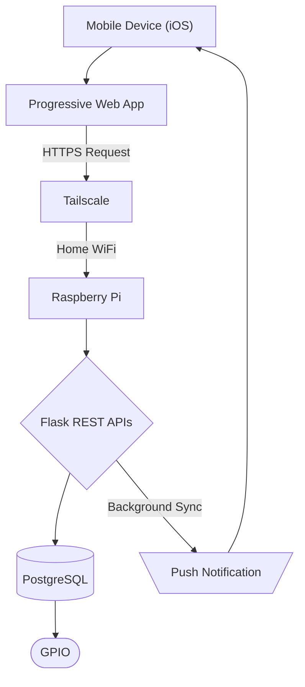

# The Quests of Life
...deserve better than a to-do list app.

## System Architecture

```mermaid
graph TD;
    A["Mobile Device (iOS)"] --> B[Progressive Web App];
    B -- HTTPS Request --> C[Tailscale];
    C -- Home WiFi --> D[Raspberry Pi];
    D --> E{Flask REST APIs};
    E --> F[(PostgreSQL)];
    E -- Background Sync --> G[\Push Notification/];
    F --> H([GPIO]);
    G --> A;
```
